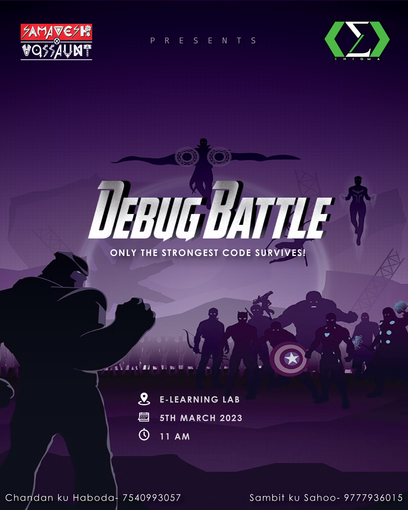

Hello Folks! We welcome you to the graphic designing team of Enigma.

# Introduction
Graphic designing is the art of creating visual content to communicate messages to the audience. It includes a wide range of fields like web design, branding, print design, packaging design, and more. This repository is created to help beginners and professionals alike to learn and improve their graphic designing skills.

# Task
You will have to design 2 posters (Any 1 topic from each event). Some posters are given below for your reference.
* Festival Posters
  * Rath Yatra
  * Independence day
* Technical Posters
  * Hackathon
  * App development workshop
  * Make an Instagram post describing Artificial intelligence 

# Submission
* You can use any designing tool for this task.
* Upload both your posters in a google drive.
* Create a text file of your name inside submissions folder.
* Paste the drive link inside the text file.
* Make sure that your drive can be viewed publicly.

**`Deadline for this task is 13th April 2023 11:59PM`**

